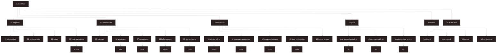
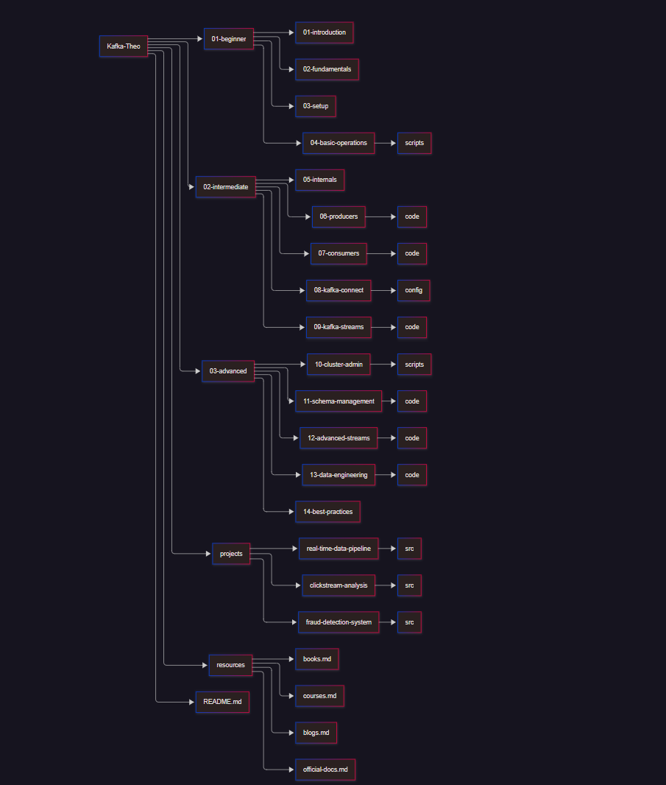

# Kafka Learning Path - From Beginner to Advanced


A comprehensive learning repository for mastering Apache Kafka and its applications in Data Engineering, from fundamental concepts to advanced implementations.

## 📚 Table of Contents

1. [Overview](#-overview)
2. [Learning Path](#-learning-path)
3. [Prerequisites](#-prerequisites)
4. [Repository Structure](#-repository-structure)
5. [Getting Started](#-getting-started)
6. [Projects](#-projects)
7. [Resources](#-resources)
8. [Contributing](#-contributing)
9. [License](#-license)

## 🎯 Overview

This repository is designed to provide a structured learning path for mastering Apache Kafka in the context of Data Engineering. It progresses from basic concepts to advanced implementations, with hands-on projects to solidify your understanding.

## 📖 Learning Path

### Beginner Level
- **Introduction to Messaging Systems**: Understanding pub/sub patterns and comparison with other messaging systems
- **Kafka Fundamentals**: Core concepts, architecture, and components
- **Setting Up Kafka**: Local installation, Docker setup, and configuration
- **Basic Operations**: Topic management, producing/consuming messages, CLI tools

### Intermediate Level
- **Kafka Internals**: Partitions, replication, fault tolerance, and log compaction
- **Kafka Producers**: Configuration, partitioning strategies, serialization
- **Kafka Consumers**: Consumer groups, offset management, delivery semantics
- **Kafka Connect**: Source and sink connectors, configuration
- **Kafka Streams**: Stream processing concepts, KStreams, KTables

### Advanced Level
- **Kafka Cluster Administration**: Multi-broker setup, monitoring, security
- **Schema Management**: Avro, Schema Registry, schema evolution
- **Advanced Kafka Streams**: Stateful operations, windowing, joining streams
- **Kafka in Data Engineering**: ETL patterns, integration with Spark/Flink, real-time analytics
- **Best Practices & Troubleshooting**: Performance tuning, common issues, disaster recovery

## 🛠 Prerequisites

Before diving into this learning path, you should have:

- Basic understanding of distributed systems
- Familiarity with Java or Scala (helpful but not mandatory)
- Knowledge of Linux command line
- Docker basics (for containerized setup)
- Understanding of fundamental data engineering concepts

## 📁 Repository Structure 





## Getting Started

### Local Setup

1. **Clone the repository**:
   ```bash
   git clone https://github.com/your-username/Kafka-Theo.git
   cd Kafka-Theo
   ```

2. **Set up Kafka using Docker**:
   Navigate to `01-beginner/03-setup/` and follow the Docker setup guide.

3. **Run basic operations**:
   Use the scripts in `01-beginner/04-basic-operations/scripts/` to create topics, produce and consume messages.

### Learning Progression

1. Start with the beginner section and complete each topic sequentially
2. Implement all code examples yourself rather than just reading them
3. Experiment with modifying parameters and configurations to understand their effects
4. Move to projects after completing the intermediate section
5. Refer to the resources section for additional learning materials

## 💻 Projects

This repository includes three practical projects to apply your Kafka knowledge:

1. **Real-time Data Pipeline**: Building an end-to-end data pipeline with Kafka
2. **Clickstream Analysis**: Processing and analyzing user clickstream data in real-time
3. **Fraud Detection System**: Implementing a real-time fraud detection system using Kafka Streams

Each project includes:
- Detailed requirements and design documentation
- Docker setup for dependencies
- Complete implementation code
- Testing guidelines

## 📚 Resources

### Books
- "Kafka: The Definitive Guide" by Gwen Shapira, Todd Palino, et al.
- "Designing Event-Driven Systems" by Ben Stopford
- "Kafka Streams in Action" by William P. Bejeck Jr.

### Online Courses
- [Confluent Kafka Courses](https://www.confluent.io/training/)
- [Udemy: Apache Kafka Series](https://www.udemy.com/user/stephane-maarek/)
- [Coursera: Real-Time Data Processing](https://www.coursera.org/specializations/real-time-data-processing)

### Official Documentation
- [Apache Kafka Documentation](https://kafka.apache.org/documentation/)
- [Confluent Documentation](https://docs.confluent.io/home/overview.html)
- [Kafka Streams Documentation](https://kafka.apache.org/documentation/streams/)

### Blogs and Communities
- [Confluent Blog](https://www.confluent.io/blog/)
- [Kafka Summit Videos](https://www.kafka-summit.org/)
- [r/apachekafka](https://www.reddit.com/r/apachekafka/)

## 🤝 Contributing

Contributions are welcome! If you have improvements or additional content:

1. Fork the repository
2. Create a feature branch (`git checkout -b feature/amazing-feature`)
3. Commit your changes (`git commit -m 'Add some amazing feature'`)
4. Push to the branch (`git push origin feature/amazing-feature`)
5. Open a Pull Request

Please ensure your contributions align with the learning path structure and include appropriate documentation.

## 📄 License

This project is licensed under the MIT License - see the [LICENSE](LICENSE) file for details.

---

<div align="center">

**Happy Learning!** 🚀

</div>

## 📊 Progress Tracking

You can track your progress through this learning path by checking off completed sections:

- [ ] **Beginner Level**
  - [ ] Introduction to Messaging Systems
  - [ ] Kafka Fundamentals
  - [ ] Setting Up Kafka
  - [ ] Basic Operations
  
- [ ] **Intermediate Level**
  - [ ] Kafka Internals
  - [ ] Kafka Producers
  - [ ] Kafka Consumers
  - [ ] Kafka Connect
  - [ ] Kafka Streams
  
- [ ] **Advanced Level**
  - [ ] Kafka Cluster Administration
  - [ ] Schema Management
  - [ ] Advanced Kafka Streams
  - [ ] Kafka in Data Engineering
  - [ ] Best Practices & Troubleshooting
  
- [ ] **Projects**
  - [ ] Real-time Data Pipeline
  - [ ] Clickstream Analysis
  - [ ] Fraud Detection System
